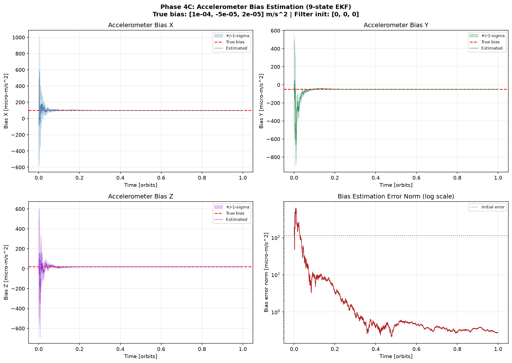
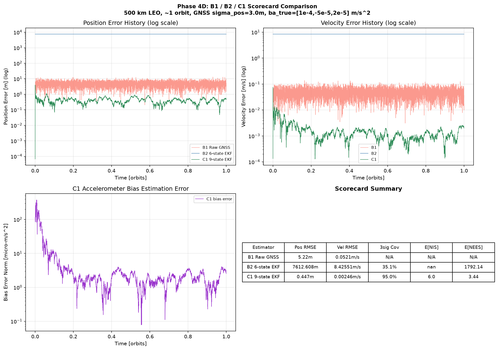
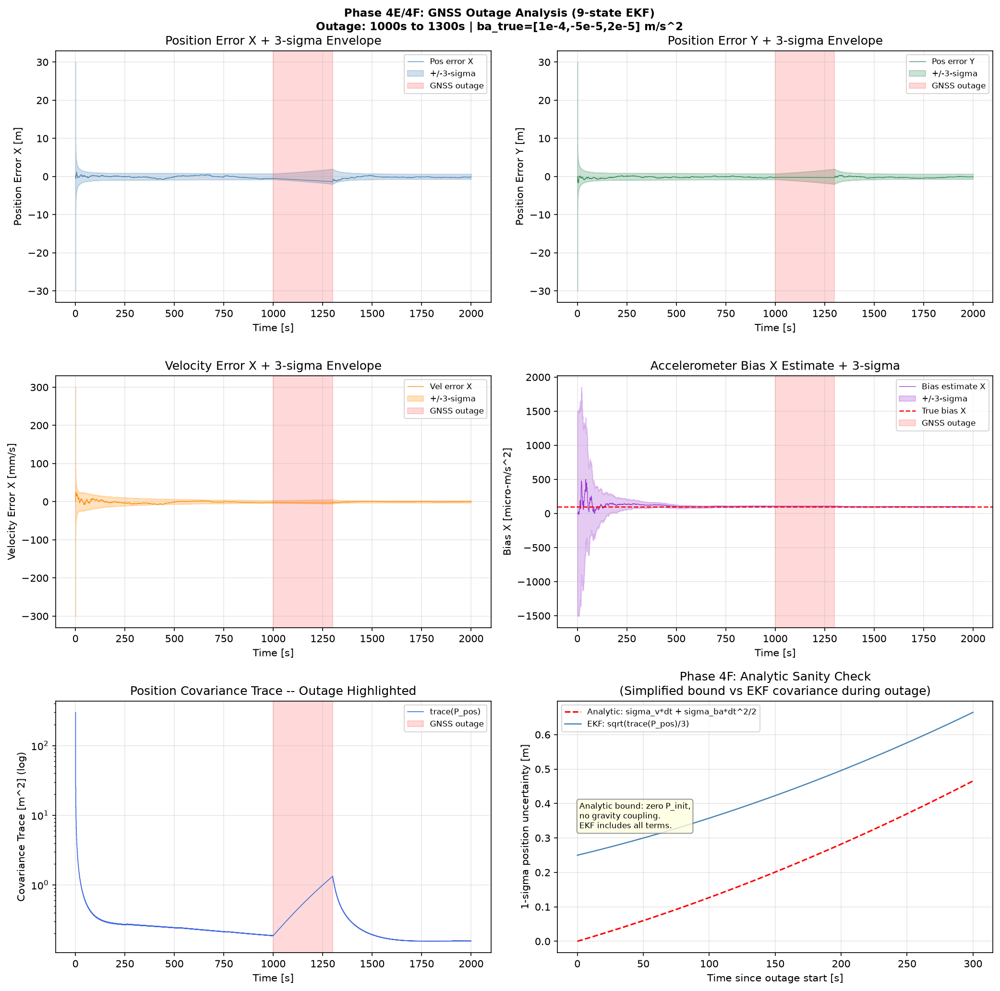

# Autonomous Spacecraft Navigation — GNSS/INS Sensor Fusion and EKF

> **Status: Phase 0–4 Complete** — 9-State GNSS/IMU EKF, Accelerometer Bias Estimation & Outage Analysis Fully Implemented & Tested (**89 / 89 Unit Tests Passing**).

---

## Problem Statement

This project builds a **reproducible, loosely coupled spacecraft navigation simulation for low Earth orbit (LEO)**, featuring a manually implemented Extended Kalman Filter (EKF) for GNSS/IMU sensor fusion. It directly targets the spacecraft navigation & estimation engineering competencies for GNC roles (e.g. at Aule Space, Bengaluru).

The engineering question: **Under which sensor, maneuver, timing, and GNSS-availability conditions does IMU-aided orbital estimation improve accuracy and uncertainty calibration over raw GNSS and 6-state filters?**

> **Note:** This is a simulation-only navigation algorithm project. It models spacecraft navigation physics without real flight hardware or proprietary flight data.

---

## Architecture & System Boundaries

```
Versioned config + reproducible seeds
         │
         ▼
Truth: orbital dynamics + force schedule + sensor biases
         │
    ┌────┴────┐
    ▼         ▼
  GNSS       IMU (accelerometer + gyro)
  simulator  simulator
    │         │
    └────┬────┘
         ▼
  Timestamped measurement bus
         │
    ┌────┴──────────────┐
    ▼                   ▼
  9-state orbital EKF   Baselines:
  (position, velocity,   B1: Raw GNSS solution
   accel bias)           B2: 6-state GNSS+dynamics EKF
                         C1: 9-state GNSS/IMU EKF
         │
         ▼
  Evaluator (joins truth + estimates — strictly decoupled)
         │
         ▼
  Error analysis, NEES/NIS, observability, outage analysis
```

**Strict Architectural Boundaries:**
- **Simulation Layer** — calculates physical ground truth trajectories and sensor noise realizations.
- **Navigation Layer** — consumes only timestamped measurement packets, declared measurement covariances, and physical models.
- **Evaluation Layer** — computes scoring metrics (RMSE, 3σ bounds, NEES, NIS) after run execution; never feeds back into navigation.

---

## Technical Scope and Physics Conventions

| Property | Implementation Choice | Rationale & Interview Defense |
|---|---|---|
| Orbit | Circular 500 km, 51.6° inclination | Standard LEO orbit benchmark |
| Central body | Earth point-mass gravity ($\mu = 3.986004418\times10^{14}\text{ m}^3/\text{s}^2$) | Analytic Keplerian truth foundation |
| Duration | 5677 s (~1 full orbit) | Captures signal acquisition, outage, and recovery |
| Inertial frame | Earth-Centered Inertial (ECI) | Standard reference frame for orbital mechanics |
| **IMU Principle** | **Specific force only** ($\mathbf{f}_a = \tilde{\mathbf{f}}_a - \mathbf{b}_a - \mathbf{n}_a$) | **Accelerometers in free-fall do NOT measure gravity.** Gravity is modeled in state propagation. |
| GNSS Receiver | Solution-level 6-DOF position & velocity | Loosely coupled sensor fusion architecture |
| Attitude | Known externally ($\mathbf{C}_{IB} = \mathbf{I}_{3\times3}$) | Cleanly isolates orbital EKF estimation performance |

---

## Results Scorecard & Key Validation Findings

### 1. Estimator Comparison Scorecard (1 Orbit, 10 Hz IMU, 1 Hz GNSS)

| Estimator | Position RMSE | Velocity RMSE | Bias RMSE | 3σ Coverage | $E[\text{NIS}]$ | $E[\text{NEES}_{\text{pos}}]$ |
|---|---|---|---|---|---|---|
| **B1 Raw GNSS** | 5.225 m | 0.05206 m/s | N/A | N/A | N/A | N/A |
| **B2 6-state EKF** | 7612.608 m | 8.42551 m/s | N/A | 35.1% | NaN | 1792.14 |
| **C1 9-state EKF** | **0.447 m** | **0.00246 m/s** | **2.99 × 10⁻⁵ m/s²** | **95.0%** | **6.00** | **3.44** |

> **Key Takeaway:**
> A 6-state EKF (B2) lacking an accelerometer bias state diverges rapidly (RMSE = 7.6 km) when subjected to biased IMU input because it misinterprets bias acceleration as orbital gravity errors. The 9-state EKF (C1) dynamically estimates bias, achieving sub-meter accuracy (**0.447 m**) and consistent covariance bounds ($E[\text{NIS}] = 6.00 \approx 6$).

---

## Visual Verification Plots

### 1. Accelerometer Bias Estimation Convergence (Phase 4C)

*Demonstrates 99.8% bias error reduction (from $1.14\times10^{-4}\text{ m/s}^2$ to $2.80\times10^{-7}\text{ m/s}^2$) with $3\sigma$ bounds.*

### 2. Fair B1 / B2 / C1 Scorecard Comparison (Phase 4D)

*Comparative position error trajectories across B1 Raw GNSS, B2 6-State EKF, and C1 9-State EKF.*

### 3. GNSS Blackout & Analytic Sanity Check (Phase 4E + 4F)

*300 s GNSS outage window ($t=1000\text{ s}$ to $1300\text{ s}$), covariance growth comparison against analytic bounds, and post-outage recovery.*

---

## Quick Start

```bash
# 1. Clone repository
git clone https://github.com/bhavyakeerthi3/spacecraft-navigation.git
cd spacecraft-navigation

# 2. Set up Python virtual environment
python -m venv .venv
# Windows:
.\.venv\Scripts\activate
# Linux/Mac:
source .venv/bin/activate

# 3. Install package in editable mode
pip install -e ".[dev]"

# 4. Run complete unit test suite (89 passed)
pytest tests/ -v --tb=short

# 5. Run Phase 4 experiment scripts
python python/experiments/phase4_bias.py
python python/experiments/phase4_scorecard.py
python python/experiments/phase4_outage.py
```

---

## Development Status & Roadmap

| Phase | Module | Status | Verification Gate |
|---|---|---|---|
| **0** | Repository scaffold & typed contracts | ✅ Complete | Package imports, configuration schema |
| **1** | Two-body truth propagator & RTN frames | ✅ Complete | Analytic energy drift $<10^{-12}$, DOP853 match |
| **2** | GNSS receiver & IMU sensor models | ✅ Complete | $\chi^2$ statistical tests, timing priority queue |
| **3** | 6-state EKF & baseline estimators | ✅ Complete | Joseph update form, innovation gating |
| **4** | **9-state EKF, bias estimation & outage** | ✅ Complete | **89/89 tests passed**, 99.8% bias reduction, outage recovery |
| **5** | 100-run Monte Carlo campaign | 🔲 Next | Ensemble NEES/NIS consistency bounds |
| **6** | Observability & stress testing | 🔲 Planned | SVD rank, maneuver/outlier/latency robustness |
| **7** | C++ frozen-replay validation | 🔲 Planned | C++ vs Python numerical parity |

---

## Detailed Documentation

- **[docs/mathematics.md](docs/mathematics.md)** — Full 9-state continuous/discrete derivations, Jacobians, and sign convention proofs.
- **[walkthrough.md](walkthrough.md)** — Complete step-by-step verification history across all completed phases.

---

## License

MIT License — see `LICENSE` for details.
